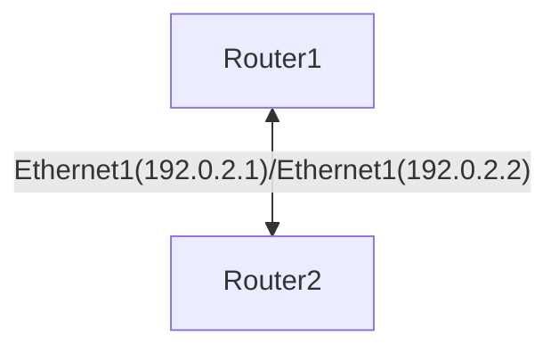
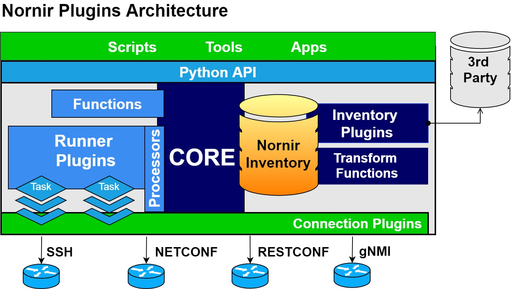

# nornir-playground

This project is gonna be used for a workshop in the [Barcelona PyDay 2023](https://pybcn.org/events/pyday_bcn/pyday_bcn_2023/#agenda_section)

## Workshop Agenda

- Context
  - Understanding Networking/Infrastructure management
  - Nornir versus Ansible
- Network Scenario
- Nornir Plugins
- Getting started with Nornir
- Nornir Inventory
- Creating a dummy Nornir Task
- Using NAPALM Nornir plugin to GET data
- Using NAPALM Nornir plugin to WRITE data
- Advanced Nornir Inventory management

## Network Scenario

Containerized Arista EOS Operating System using [Containerlab](https://containerlab.dev/)



The goal of the scenario is to configure the Ethernet interfaces with the corresponding IP addresses.

## Nornir Plugins



Existing Nornir plugins: https://nornir.tech/nornir/plugins/

## Getting started with Nornir

Install Nornir

```bash
pip install nornir
```

Create Nornir config: `config.yaml`

```yaml
---
inventory:
  plugin: "SimpleInventory"
  options:
    host_file: "inventory/hosts.yaml"
    group_file: "inventory/groups.yaml"
runner:
  plugin: "threaded"
  options:
    num_workers: 20
```

## Nornir Inventory

### Nornir host_file: `inventory/hosts.yaml`

Contains the specific data for a host (key)

```yaml
---
router1:
  hostname: "1.2.3.4" # use your IP Address
  platform: "eos"
  groups:
    - "the-lab"
  connection_options:
    napalm:
      extras:
        optional_args:
          port: 1234 # use your Port
          transport: "ssh"
router2:
  hostname: "1.2.3.4" # use your IP Address
  platform: "eos"
  groups:
    - "the-lab"
  connection_options:
    napalm:
      extras:
        optional_args:
          port: 1234 # use your Port
          transport: "ssh"
```

### Nornir group_file: `inventory/groups.yaml`

Group data applies to all the hosts that belong to the group

```yaml
---
the-lab:
  data:
    network: "192.0.2.0/24"
  username: "admin"
  password: "admin"
```

### Check the Inventory

```py
>>> from nornir import InitNornir
>>> nr = InitNornir(config_file="config.yaml")
>>> nr.inventory.hosts
{'router1': Host: router1, 'router2': Host: router2}

```

Notice how the data from the `the-lab` group is inherited by the hosts:

```py
>>> nr.inventory.hosts["router1"]["network"]
'192.0.2.0/24'
```

## Creating a dummy Nornir Task

Let's define a dummy task to see how Nornir runs:

```py
>>> from nornir.core.task import Task, Result
>>> import ipaddress
>>>
>>> def get_my_interface_ip(task: Task, host_id: int) -> Result:
...     ip_network = ipaddress.IPv4Network(task.host["network"])
...     for count, ip_address in enumerate(ip_network):
...         if host_id == count or host_id == count:
...             break
...     else:
...         raise ValueError("Only host IDs 1 and 2 are supported")
...     return Result(
...         host=task.host,
...         result=ipaddress.IPv4Interface(f"{ip_address}/{ip_network.prefixlen}"),
...     )
...
```

Run the task:

```py
>>> result = nr.run(task=get_my_interface_ip, host_id=1)
>>> result
AggregatedResult (get_my_interface_ip): {'router1': MultiResult: [Result: "get_my_interface_ip"], 'router2': MultiResult: [Result: "get_my_interface_ip"]}
>>> result["router1"]
MultiResult: [Result: "get_my_interface_ip"]
>>> result["router1"][0].result
IPv4Interface('192.0.2.1/24')
```

The inventory can use the `filter` method to narrow down the scope:

```py
>>> result = nr.filter(name="router1").run(task=get_my_interface_ip, host_id=1)
>>> result
AggregatedResult (get_my_interface_ip): {'router1': MultiResult: [Result: "get_my_interface_ip"]}
```

## Using NAPALM Nornir plugin to GET data

NAPALM is a Python library that extracts normalized data from network devices.

Install NAPALM Nornir plugin

```py
$ pip install napalm nornir-napalm
```

Use the `napalm_get` task to extract basic data.

```py
>>> from nornir_napalm.plugins.tasks import napalm_get
>>> from nornir import InitNornir
>>> nr = InitNornir(config_file="config.yaml")
>>> result = nr.filter(name="router1").run(task=napalm_get, getters=["get_facts"])
>>> result["router1"].result
{'get_facts': {'hostname': 'ceos-01', 'fqdn': 'ceos-01', 'vendor': 'Arista', 'model': 'cEOSLab', 'serial_number': '3C91BB3EE8CEA85DFDC7AA49EC493EAC', 'os_version': '4.30.1F-32315456.4301F', 'uptime': 14839.204649925232, 'interface_list': ['Ethernet1', 'Management0']}}
```

Let's make sure that the ping is **NOT** working:

```py
>>> from nornir_napalm.plugins.tasks import napalm_ping
>>> from nornir import InitNornir
>>> nr = InitNornir(config_file="config.yaml")
>>> result = nr.filter(name="router1").run(task=napalm_ping, dest="192.0.2.2")
>>> result["router1"].result
{'success': {'probes_sent': 5, 'packet_loss': 5, 'rtt_min': 0.0, 'rtt_max': 0.0, 'rtt_avg': 0.0, 'rtt_stddev': 0.0, 'results': []}}
```

## Using NAPALM Nornir plugin to WRITE data

Finally, we are ready to set up the network scenario. We will create a new Nornir Task that concatenates three tasks:

- Use the dummy task to obtain the corresponding IP address per network device
- Render the configuration artifact for each device (using a Jinja2 Nornir plugin)
- Deploy the rendered configuration to the devices using a NAPALM task

```bash
pip install nornir_jinja2
pip install nornir_utils
```

Let's create a script `config_task.py` to render the corresponding configuration, and deploy to the devices.

```py
import ipaddress
from nornir import InitNornir
from nornir.core.task import Result, Task
from nornir_jinja2.plugins.tasks import template_string
from nornir_napalm.plugins.tasks import napalm_configure
from nornir_utils.plugins.functions import print_result

# TEMPLATE represents an option to manage multiple templates per platform
TEMPLATE = {
    "eos": "interface Ethernet1\nno switchport\nip address {{ ip_address }}\nno shutdown",
}


def get_my_interface_ip(task: Task, host_id: int) -> Result:
    ip_network = ipaddress.IPv4Network(task.host["network"])

    for count, ip_address in enumerate(ip_network):
        if host_id == count or host_id == count:
            break
    else:
        raise ValueError("Only host IDs 1 and 2 are supported")

    return Result(
        host=task.host,
        result=ipaddress.IPv4Interface(f"{ip_address}/{ip_network.prefixlen}"),
    )


def config_task(task: Task, template) -> Result:
    """Nornir task that combines two subtasks:
    - Render a configuration from a Jinja2 template
    - Push the rendered configuration to the device
    """
    result_ip = task.run(
        task=get_my_interface_ip, host_id=1 if task.host.name == "router1" else 2
    )

    render_result = task.run(
        task=template_string,
        # The right template per platform is selected
        template=template[task.host.platform],
        ip_address=str(result_ip.result),
    )

    config_result = task.run(
        task=napalm_configure,
        # The rendered configuration from previous subtask is used
        # as the configuration input
        configuration=render_result.result,
        # dry_run means the changes without applying them
        dry_run=True,
    )

    return Result(host=task.host, result=config_result)


# Initialize Nornir inventory from a file
nr = InitNornir(config_file="config.yaml")
# The `config_task` will aggregate two subtasks
result = nr.run(
    task=config_task,
    template=TEMPLATE,
)

print_result(result)

```

Run the script:

```bash
(.venv) ➜  example git:(main) ✗ python config_task.py
config_task*********************************************************************
* router1 ** changed : True ****************************************************
vvvv config_task ** changed : False vvvvvvvvvvvvvvvvvvvvvvvvvvvvvvvvvvvvvvvvvvvv INFO
MultiResult: [Result: "napalm_configure"]
---- get_my_interface_ip ** changed : False ------------------------------------ INFO
IPv4Interface('192.0.2.1/24')
---- template_string ** changed : False ---------------------------------------- INFO
interface Ethernet1
no switchport
ip address 192.0.2.1/24
no shutdown
---- napalm_configure ** changed : True ---------------------------------------- INFO
interface Ethernet1
+   no switchport
+   ip address 192.0.2.1/24
^^^^ END config_task ^^^^^^^^^^^^^^^^^^^^^^^^^^^^^^^^^^^^^^^^^^^^^^^^^^^^^^^^^^^
* router2 ** changed : True ****************************************************
vvvv config_task ** changed : False vvvvvvvvvvvvvvvvvvvvvvvvvvvvvvvvvvvvvvvvvvvv INFO
MultiResult: [Result: "napalm_configure"]
---- get_my_interface_ip ** changed : False ------------------------------------ INFO
IPv4Interface('192.0.2.2/24')
---- template_string ** changed : False ---------------------------------------- INFO
interface Ethernet1
no switchport
ip address 192.0.2.2/24
no shutdown
---- napalm_configure ** changed : True ---------------------------------------- INFO
interface Ethernet1
+   no switchport
+   ip address 192.0.2.2/24
^^^^ END config_task ^^^^^^^^^^^^^^^^^^^^^^^^^^^^^^^^^^^^^^^^^^^^^^^^^^^^^^^^^^^
```

Let's make sure that the communication is now working

```py
>>> from nornir_napalm.plugins.tasks import napalm_ping
>>> from nornir import InitNornir
>>> nr = InitNornir(config_file="config.yaml")
>>> result = nr.filter(name="router1").run(task=napalm_ping, dest="192.0.2.2")
>>> result["router1"].result
{'success': {'probes_sent': 5, 'packet_loss': 0, 'rtt_min': 0.036, 'rtt_max': 0.213, 'rtt_avg': 0.085, 'rtt_stddev': 0.067, 'results': [{'ip_address': '192.0.2.2', 'rtt': 0.213}, {'ip_address': '192.0.2.2', 'rtt': 0.089}, {'ip_address': '192.0.2.2', 'rtt': 0.053}, {'ip_address': '192.0.2.2', 'rtt': 0.036}, {'ip_address': '192.0.2.2', 'rtt': 0.038}]}}
>>>
```

## Advanced Nornir Inventory management

We use a network data management open source project ([Nautobot](https://docs.nautobot.com/projects/core/en/stable/)) that offers a Nornir plugin to fetch the inventory externally.

First, we install the Nautobot-Nornir plugins:

```bash
pip install nornir-nautobot packaging
```

And now, we can use it modifying the Nornir configuration directly.

```py
>>> from nornir import InitNornir
>>> nr = InitNornir(
...     inventory={
...         "plugin": "NautobotInventory",
...         "options": {
...             "nautobot_url": "https://demo.nautobot.com",
...             "nautobot_token": "a" * 40,
...         },
...     },
... )
>>> len(nr.inventory.hosts)
921
```

Check a real example of data:

```py
>>> nr.inventory.hosts['ams01-dist-01'].data
{'pynautobot_object': <pynautobot.models.dcim.Devices ('ams01-dist-01') at 0x111677280>, 'pynautobot_dictionary': {'id': '89b2ac3b-1853-4eeb-9ea6-6a081999bd3c', 'object_type': 'dcim.device', 'display': 'ams01-dist-01', 'url': 'https://demo.nautobot.com/api/dcim/devices/89b2ac3b-1853-4eeb-9ea6-6a081999bd3c/', 'natural_slug': 'ams01-dist-01_nautobot-airports_ams01_netherlands_europe_89b2', 'face': None, 'local_config_context_data': None, 'local_config_context_data_owner_object_id': None, 'name': 'ams01-dist-01', 'serial': '', 'asset_tag': None, 'position': None, 'device_redundancy_group_priority': None, 'vc_position': None, 'vc_priority': None, 'comments': '', 'local_config_context_schema': None, 'local_config_context_data_owner_content_type': None, 'device_type': {'id': '4bf23e23-4eb1-4fae-961c-edd6f8cbaaf1', 'object_type': 'dcim.devicetype', 'display': 'Cisco Catalyst 6509-E', 'url': 'https://demo.nautobot.com/api/dcim/device-types/4bf23e23-4eb1-4fae-961c-edd6f8cbaaf1/', 'natural_slug': 'cisco_catalyst-6509-e_4bf2', 'subdevice_role': None, 'front_image': None, 'rear_image': None, 'model': 'Catalyst 6509-E', 'part_number': 'WS-C6509-E', 'u_height': 14, 'is_full_depth': True, 'comments': '', 'manufacturer': {'id': 'b329ec0d-5ee7-47d8-b4a7-3951c28e2979', 'object_type': 'dcim.manufacturer', 'url': 'https://demo.nautobot.com/api/dcim/manufacturers/b329ec0d-5ee7-47d8-b4a7-3951c28e2979/'}, 'created': '2023-09-21T00:00:00Z', 'last_updated': '2023-09-21T19:51:28.744582Z', 'notes_url': 'https://demo.nautobot.com/api/dcim/device-types/4bf23e23-4eb1-4fae-961c-edd6f8cbaaf1/notes/', 'custom_fields': {}}, 'status': {'id': '9f38bab4-4b47-4e77-b50c-fda62817b2db', 'object_type': 'extras.status', 'display': 'Active', 'url': 'https://demo.nautobot.com/api/extras/statuses/9f38bab4-4b47-4e77-b50c-fda62817b2db/', 'natural_slug': 'active_9f38', 'name': 'Active', 'color': '4caf50', 'description': 'Unit is active', 'created': '2023-09-21T00:00:00Z', 'last_updated': '2023-09-21T19:46:47.125611Z', 'notes_url': 'https://demo.nautobot.com/api/extras/statuses/9f38bab4-4b47-4e77-b50c-fda62817b2db/notes/', 'custom_fields': {}}, 'role': {'id': '40567487-6328-4dac-b7b5-b789d1154bf0', 'object_type': 'extras.role', 'display': 'distribution', 'url': 'https://demo.nautobot.com/api/extras/roles/40567487-6328-4dac-b7b5-b789d1154bf0/', 'natural_slug': 'distribution_4056', 'name': 'distribution', 'color': '2196f3', 'description': '', 'weight': None, 'created': '2023-10-31T00:00:00Z', 'last_updated': '2023-10-31T18:51:42.278055Z', 'notes_url': 'https://demo.nautobot.com/api/extras/roles/40567487-6328-4dac-b7b5-b789d1154bf0/notes/', 'custom_fields': {}}, 'tenant': {'id': '1f7fbd07-111a-4091-81d0-f34db26d961d', 'object_type': 'tenancy.tenant', 'display': 'Nautobot Airports', 'url': 'https://demo.nautobot.com/api/tenancy/tenants/1f7fbd07-111a-4091-81d0-f34db26d961d/', 'natural_slug': 'nautobot-airports_1f7f', 'name': 'Nautobot Airports', 'description': 'atc.nautobot.com', 'comments': '', 'tenant_group': None, 'created': '2023-09-21T00:00:00Z', 'last_updated': '2023-09-21T19:46:55.974813Z', 'notes_url': 'https://demo.nautobot.com/api/tenancy/tenants/1f7fbd07-111a-4091-81d0-f34db26d961d/notes/', 'custom_fields': {}}, 'platform': {'id': 'aa07ca99-b973-4870-9b44-e1ea48c23cc9', 'object_type': 'dcim.platform', 'display': 'Cisco IOS', 'url': 'https://demo.nautobot.com/api/dcim/platforms/aa07ca99-b973-4870-9b44-e1ea48c23cc9/', 'natural_slug': 'cisco-ios_aa07', 'network_driver_mappings': {}, 'name': 'Cisco IOS', 'network_driver': '', 'napalm_driver': 'ios', 'napalm_args': None, 'description': '', 'manufacturer': {'id': 'b329ec0d-5ee7-47d8-b4a7-3951c28e2979', 'object_type': 'dcim.manufacturer', 'url': 'https://demo.nautobot.com/api/dcim/manufacturers/b329ec0d-5ee7-47d8-b4a7-3951c28e2979/'}, 'created': '2023-09-21T00:00:00Z', 'last_updated': '2023-09-21T19:46:57.381841Z', 'notes_url': 'https://demo.nautobot.com/api/dcim/platforms/aa07ca99-b973-4870-9b44-e1ea48c23cc9/notes/', 'custom_fields': {}}, 'location': {'id': '9e39051b-e968-4016-b0cf-63a5607375de', 'object_type': 'dcim.location', 'display': 'Europe → Netherlands → AMS01', 'url': 'https://demo.nautobot.com/api/dcim/locations/9e39051b-e968-4016-b0cf-63a5607375de/', 'natural_slug': 'ams01_netherlands_europe_9e39', 'time_zone': None, 'name': 'AMS01', 'description': '', 'facility': 'Amsterdam Airport Schiphol', 'asn': None, 'physical_address': '', 'shipping_address': '', 'latitude': None, 'longitude': None, 'contact_name': '', 'contact_phone': '', 'contact_email': '', 'comments': '', 'parent': {'id': '06d24511-3fcb-4156-aa35-34069116beed', 'object_type': 'dcim.location', 'url': 'https://demo.nautobot.com/api/dcim/locations/06d24511-3fcb-4156-aa35-34069116beed/'}, 'location_type': {'id': 'db20360d-ba02-48eb-8297-7013f3f6b9ca', 'object_type': 'dcim.locationtype', 'url': 'https://demo.nautobot.com/api/dcim/location-types/db20360d-ba02-48eb-8297-7013f3f6b9ca/'}, 'status': {'id': '9f38bab4-4b47-4e77-b50c-fda62817b2db', 'object_type': 'extras.status', 'url': 'https://demo.nautobot.com/api/extras/statuses/9f38bab4-4b47-4e77-b50c-fda62817b2db/'}, 'tenant': {'id': '1f7fbd07-111a-4091-81d0-f34db26d961d', 'object_type': 'tenancy.tenant', 'url': 'https://demo.nautobot.com/api/tenancy/tenants/1f7fbd07-111a-4091-81d0-f34db26d961d/'}, 'created': '2023-10-31T00:00:00Z', 'last_updated': '2023-10-31T18:52:46.637680Z', 'notes_url': 'https://demo.nautobot.com/api/dcim/locations/9e39051b-e968-4016-b0cf-63a5607375de/notes/', 'custom_fields': {'site_type': 'POP'}}, 'rack': None, 'primary_ip4': None, 'primary_ip6': None, 'cluster': None, 'virtual_chassis': None, 'device_redundancy_group': None, 'secrets_group': None, 'created': '2023-09-21T00:00:00Z', 'last_updated': '2023-09-21T19:51:28.755228Z', 'tags': [], 'notes_url': 'https://demo.nautobot.com/api/dcim/devices/89b2ac3b-1853-4eeb-9ea6-6a081999bd3c/notes/', 'custom_fields': {}, 'parent_bay': None}}
```

Use advanced filtering:

```py
>>> from nornir.core.filter import F
>>> len(nr.filter(F(data__pynautobot_dictionary__platform__name="Arista EOS")).inventory.hosts)
341
>>> len(nr.
...   filter(F(data__pynautobot_dictionary__platform__name="Arista EOS")).
...   filter(F(data__pynautobot_dictionary__role__name="edge")).
...   inventory.hosts
... )
70
```

## Lab Deployment

> Note: this is only for setting up the development environment

The lab is deployed using [Containerlab](https://containerlab.dev/) within a Digital Ocean droplet. To serve many network scenarios, we use a simple topology that is exposed externally via `socat` in different ports (mapping to the SSH 22).

```bash
cd lab
terraform init
terraform apply
```

Check redirected ports:

```bash
sudo lsof -i -P -n | grep LISTEN
```

```bash
socat TCP-LISTEN:12001,reuseaddr,fork TCP:ceos-01:22 &
socat TCP-LISTEN:12002,reuseaddr,fork TCP:ceos-02:22 &
socat TCP-LISTEN:12003,reuseaddr,fork TCP:ceos-03:22 &
socat TCP-LISTEN:12004,reuseaddr,fork TCP:ceos-04:22 &
socat TCP-LISTEN:12005,reuseaddr,fork TCP:ceos-05:22 &
socat TCP-LISTEN:12006,reuseaddr,fork TCP:ceos-06:22 &
socat TCP-LISTEN:12007,reuseaddr,fork TCP:ceos-07:22 &
socat TCP-LISTEN:12008,reuseaddr,fork TCP:ceos-08:22 &
socat TCP-LISTEN:12009,reuseaddr,fork TCP:ceos-09:22 &
socat TCP-LISTEN:12010,reuseaddr,fork TCP:ceos-10:22 &
socat TCP-LISTEN:12011,reuseaddr,fork TCP:ceos-11:22 &
socat TCP-LISTEN:12012,reuseaddr,fork TCP:ceos-12:22 &
socat TCP-LISTEN:12013,reuseaddr,fork TCP:ceos-13:22 &
socat TCP-LISTEN:12014,reuseaddr,fork TCP:ceos-14:22 &
socat TCP-LISTEN:12015,reuseaddr,fork TCP:ceos-15:22 &
socat TCP-LISTEN:12016,reuseaddr,fork TCP:ceos-16:22 &
socat TCP-LISTEN:12017,reuseaddr,fork TCP:ceos-17:22 &
socat TCP-LISTEN:12018,reuseaddr,fork TCP:ceos-18:22 &
socat TCP-LISTEN:12019,reuseaddr,fork TCP:ceos-19:22 &
socat TCP-LISTEN:12020,reuseaddr,fork TCP:ceos-20:22 &
socat TCP-LISTEN:12021,reuseaddr,fork TCP:ceos-21:22 &
socat TCP-LISTEN:12022,reuseaddr,fork TCP:ceos-22:22 &
socat TCP-LISTEN:12023,reuseaddr,fork TCP:ceos-23:22 &
socat TCP-LISTEN:12024,reuseaddr,fork TCP:ceos-24:22 &
socat TCP-LISTEN:12025,reuseaddr,fork TCP:ceos-25:22 &
socat TCP-LISTEN:12026,reuseaddr,fork TCP:ceos-26:22 &
socat TCP-LISTEN:12027,reuseaddr,fork TCP:ceos-27:22 &
socat TCP-LISTEN:12028,reuseaddr,fork TCP:ceos-28:22 &
```

## Validate LAB access

Using the IP address and TCP port provisioned, connect to the routers via SSH. These are the credentials to be used in the automation lab.

```bash
$ ssh admin@1.2.3.4 -p 12001
```
