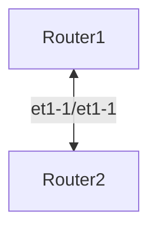

# nornir-playground

This project is gonna be used for a workshop in the Barcelona PyDay

## Agenda

- Networking/Infrastructure management
- Nornir versus Ansible
- Network Scenario
- Nornir Inventory
- Nornir Plugins
- Nornir - NAPALM - get_gacts
- Nornir - NAPALM - configura
- Nornir - NAPALM - check status

## Network Scenario



The goals of the workshop are:

- Validate scenario status (retrieve stats)
- Configure the link between both network devices with network 192.0.2.0/24
- Check reachability over the link with a ping

## Workshop

### Getting started with Nornir

Install Nornir

```bash
pip install nornir
```

### Initializing Nornir

Create Nornir config: `config.yaml`

```yaml
---
inventory:
  plugin: "SimpleInventory"
  options:
    host_file: "inventory/hosts.yaml"
    group_file: "inventory/groups.yaml"
runner:
  plugin: "threaded"
  options:
    num_workers: 20
```

### Defining the Inventory

Create Nornir host_file

```yaml
---
router1:
  hostname: "1.2.3.4" # use your IP Address
  platform: "eos"
  groups:
    - "the-lab"
  connection_options:
    napalm:
      extras:
        optional_args:
          port: 12001 # use your Port
          transport: "ssh"
router2:
  hostname: "1.2.3.4" # use your IP Address
  platform: "eos"
  groups:
    - "the-lab"
  connection_options:
    napalm:
      extras:
        optional_args:
          port: 12002 # use your Port
          transport: "ssh"
```

Create Nornir group_file

```yaml
---
the-lab:
  data:
    network: "192.0.2.0/24"
  username: "admin"
  password: "admin"
```

Check the inventory

```py
>>> from nornir import InitNornir
>>> nr = InitNornir(config_file="config.yaml")
>>> nr.inventory.hosts
{'router1': Host: router1, 'router2': Host: router2}

```

Notice how the data from the Group is inherited by the Hosts

```py
>>> nr.inventory.hosts["router1"]["network"]
'192.0.2.0/24'
```

### Creating a dummy task

Let's define a dummy task to see how Nornir runs:

```py
>>> from nornir.core.task import Task, Result
>>> import ipaddress
>>>
>>> def get_my_interface_ip(task: Task, host_id: int) -> Result:
>>>     ip_network = ipaddress.IPv4Network(task.host["network"])
>>>
>>>     for count, ip_address in enumerate(ip_network):
>>>         if host_id == count or host_id == count:
>>>             break
>>>     else:
>>>         raise ValueError("Only host IDs 1 and 2 are supported")
>>>
>>>     return Result(
>>>         host=task.host,
>>>         result=ipaddress.IPv4Interface(f"{ip_address}/{ip_network.prefixlen}"),
>>>     )
```

Run the task

```py
>>> result = nr.run(task=get_my_interface_ip, host_id=1)
>>> result
AggregatedResult (get_my_interface_ip): {'router1': MultiResult: [Result: "get_my_interface_ip"], 'router2': MultiResult: [Result: "get_my_interface_ip"]}
>>> result["router1"]
MultiResult: [Result: "get_my_interface_ip"]
>>> result["router1"][0].result
IPv4Interface('192.0.2.1/24')
```

### Using NAPALM Nornir plugin

NAPALM is a python library that extract normalized data from the network devices.

Install NAPALM Nornir plugin

```py
$ pip install napalm nornir-napalm
```

Use the `napalm_get` task to extract basic data.

```py
>>> from nornir_napalm.plugins.tasks import napalm_get
>>> from nornir import InitNornir
>>> nr = InitNornir(config_file="config.yaml")
>>> result = nr.filter(name="router1").run(task=napalm_get, getters=["get_facts"])
>>> result["router1"].result
{'get_facts': {'hostname': 'ceos-01', 'fqdn': 'ceos-01', 'vendor': 'Arista', 'model': 'cEOSLab', 'serial_number': '3C91BB3EE8CEA85DFDC7AA49EC493EAC', 'os_version': '4.30.1F-32315456.4301F', 'uptime': 14839.204649925232, 'interface_list': ['Ethernet1', 'Management0']}}
```

Let's make sure that the ping is not working:

```py
>>> from nornir_napalm.plugins.tasks import napalm_ping
>>> from nornir import InitNornir
>>> nr = InitNornir(config_file="config.yaml")
>>> result = nr.filter(name="router1").run(task=napalm_ping, dest="192.0.2.2")
>>> result["router1"].result
{'success': {'probes_sent': 5, 'packet_loss': 5, 'rtt_min': 0.0, 'rtt_max': 0.0, 'rtt_avg': 0.0, 'rtt_stddev': 0.0, 'results': []}}
```

### Concatenate different tasks to configure a network device

```bash
pip install nornir_jinja2
pip install nornir_utils
```

The script `config_task.py`:

```py
import ipaddress
from nornir import InitNornir
from nornir.core.task import Result, Task
from nornir_jinja2.plugins.tasks import template_string
from nornir_napalm.plugins.tasks import napalm_configure
from nornir_utils.plugins.functions import print_result

# TEMPLATE represents an option to manage multiple templates per platform
TEMPLATE = {
    "eos": "interface Ethernet1\nno switchport\nip address {{ ip_address }}\nno shutdown",
}


def get_my_interface_ip(task: Task, host_id: int) -> Result:
    ip_network = ipaddress.IPv4Network(task.host["network"])

    for count, ip_address in enumerate(ip_network):
        if host_id == count or host_id == count:
            break
    else:
        raise ValueError("Only host IDs 1 and 2 are supported")

    return Result(
        host=task.host,
        result=ipaddress.IPv4Interface(f"{ip_address}/{ip_network.prefixlen}"),
    )


def config_task(task: Task, template) -> Result:
    """Nornir task that combines two subtasks:
    - Render a configuration from a Jinja2 template
    - Push the rendered configuration to the device
    """
    result_ip = task.run(
        task=get_my_interface_ip, host_id=1 if task.host.name == "router1" else 2
    )

    render_result = task.run(
        task=template_string,
        # The right template per platform is selected
        template=template[task.host.platform],
        ip_address=str(result_ip.result),
    )

    config_result = task.run(
        task=napalm_configure,
        # The rendered configuration from previous subtask is used
        # as the configuration input
        configuration=render_result.result,
        # dry_run means the changes without applying them
        dry_run=False,
    )

    return Result(host=task.host, result=config_result)


# Initialize Nornir inventory from a file
nr = InitNornir(config_file="config.yaml")
# The `config_task` will aggregate two subtasks
result = nr.run(
    task=config_task,
    template=TEMPLATE,
)

print_result(result)

```

Run the script:

```bash
(.venv) ➜  example git:(main) ✗ python config_task.py
config_task*********************************************************************
* router1 ** changed : True ****************************************************
vvvv config_task ** changed : False vvvvvvvvvvvvvvvvvvvvvvvvvvvvvvvvvvvvvvvvvvvv INFO
MultiResult: [Result: "napalm_configure"]
---- get_my_interface_ip ** changed : False ------------------------------------ INFO
IPv4Interface('192.0.2.1/24')
---- template_string ** changed : False ---------------------------------------- INFO
interface Ethernet1
no switchport
ip address 192.0.2.1/24
no shutdown
---- napalm_configure ** changed : True ---------------------------------------- INFO
interface Ethernet1
+   no switchport
+   ip address 192.0.2.1/24
^^^^ END config_task ^^^^^^^^^^^^^^^^^^^^^^^^^^^^^^^^^^^^^^^^^^^^^^^^^^^^^^^^^^^
* router2 ** changed : True ****************************************************
vvvv config_task ** changed : False vvvvvvvvvvvvvvvvvvvvvvvvvvvvvvvvvvvvvvvvvvvv INFO
MultiResult: [Result: "napalm_configure"]
---- get_my_interface_ip ** changed : False ------------------------------------ INFO
IPv4Interface('192.0.2.2/24')
---- template_string ** changed : False ---------------------------------------- INFO
interface Ethernet1
no switchport
ip address 192.0.2.2/24
no shutdown
---- napalm_configure ** changed : True ---------------------------------------- INFO
interface Ethernet1
+   no switchport
+   ip address 192.0.2.2/24
^^^^ END config_task ^^^^^^^^^^^^^^^^^^^^^^^^^^^^^^^^^^^^^^^^^^^^^^^^^^^^^^^^^^^
```

Successful test:

```py
>>> from nornir_napalm.plugins.tasks import napalm_ping
>>> from nornir import InitNornir
>>> nr = InitNornir(config_file="config.yaml")
>>> result = nr.filter(name="router1").run(task=napalm_ping, dest="192.0.2.2")
>>> result["router1"].result
{'success': {'probes_sent': 5, 'packet_loss': 0, 'rtt_min': 0.036, 'rtt_max': 0.213, 'rtt_avg': 0.085, 'rtt_stddev': 0.067, 'results': [{'ip_address': '192.0.2.2', 'rtt': 0.213}, {'ip_address': '192.0.2.2', 'rtt': 0.089}, {'ip_address': '192.0.2.2', 'rtt': 0.053}, {'ip_address': '192.0.2.2', 'rtt': 0.036}, {'ip_address': '192.0.2.2', 'rtt': 0.038}]}}
>>>
```

### Advanced Inventory management

```py
>>> nr = InitNornir(
...     inventory={
...         "plugin": "NautobotInventory",
...         "options": {
...             "nautobot_url": "https://demo.nautobot.com",
...             "nautobot_token": "a" * 40,
...         },
...     },
... )
>>> len(nr.inventory.hosts)
393
>>> from nornir.core.filter import F
>>> len(nr.filter(F(platform__contains="arista")).inventory.hosts)
345
>>> len(nr.
...   filter(F(platform__contains="arista")).
...   filter(F(data__pynautobot_dictionary__device_role__slug="edge")).
...   inventory.hosts
... )
72

```

## Lab deployment

The lab is deployed using [Containerlab](https://containerlab.dev/) within a Digital Ocean droplet. To serve many network scenarios, we use a simple topology which it's exposed externally via `socat` in different ports (mapping to the SSH 22).

```bash
cd lab
terraform init
terraform apply
```

Check redirected ports:

```bash
sudo lsof -i -P -n | grep LISTEN
```

```bash
socat TCP-LISTEN:12001,reuseaddr,fork TCP:ceos-01:22 &
socat TCP-LISTEN:12002,reuseaddr,fork TCP:ceos-02:22 &
socat TCP-LISTEN:12003,reuseaddr,fork TCP:ceos-03:22 &
socat TCP-LISTEN:12004,reuseaddr,fork TCP:ceos-04:22 &
socat TCP-LISTEN:12005,reuseaddr,fork TCP:ceos-05:22 &
socat TCP-LISTEN:12006,reuseaddr,fork TCP:ceos-06:22 &
socat TCP-LISTEN:12007,reuseaddr,fork TCP:ceos-07:22 &
socat TCP-LISTEN:12008,reuseaddr,fork TCP:ceos-08:22 &
socat TCP-LISTEN:12009,reuseaddr,fork TCP:ceos-09:22 &
socat TCP-LISTEN:12010,reuseaddr,fork TCP:ceos-10:22 &
socat TCP-LISTEN:12011,reuseaddr,fork TCP:ceos-11:22 &
socat TCP-LISTEN:12012,reuseaddr,fork TCP:ceos-12:22 &
socat TCP-LISTEN:12013,reuseaddr,fork TCP:ceos-13:22 &
socat TCP-LISTEN:12014,reuseaddr,fork TCP:ceos-14:22 &
socat TCP-LISTEN:12015,reuseaddr,fork TCP:ceos-15:22 &
socat TCP-LISTEN:12016,reuseaddr,fork TCP:ceos-16:22 &
socat TCP-LISTEN:12017,reuseaddr,fork TCP:ceos-17:22 &
socat TCP-LISTEN:12018,reuseaddr,fork TCP:ceos-18:22 &
socat TCP-LISTEN:12019,reuseaddr,fork TCP:ceos-19:22 &
socat TCP-LISTEN:12020,reuseaddr,fork TCP:ceos-20:22 &
socat TCP-LISTEN:12021,reuseaddr,fork TCP:ceos-21:22 &
socat TCP-LISTEN:12022,reuseaddr,fork TCP:ceos-22:22 &
socat TCP-LISTEN:12023,reuseaddr,fork TCP:ceos-23:22 &
socat TCP-LISTEN:12024,reuseaddr,fork TCP:ceos-24:22 &
socat TCP-LISTEN:12025,reuseaddr,fork TCP:ceos-25:22 &
socat TCP-LISTEN:12026,reuseaddr,fork TCP:ceos-26:22 &
socat TCP-LISTEN:12027,reuseaddr,fork TCP:ceos-27:22 &
socat TCP-LISTEN:12028,reuseaddr,fork TCP:ceos-28:22 &
```

## Validate LAB access

Using the IP address and TCP port provisioned, connect to the routers via SSH. These are the credentials to be used in the automation lab.

```bash
$ ssh admin@1.2.3.4 -p 12001
```
